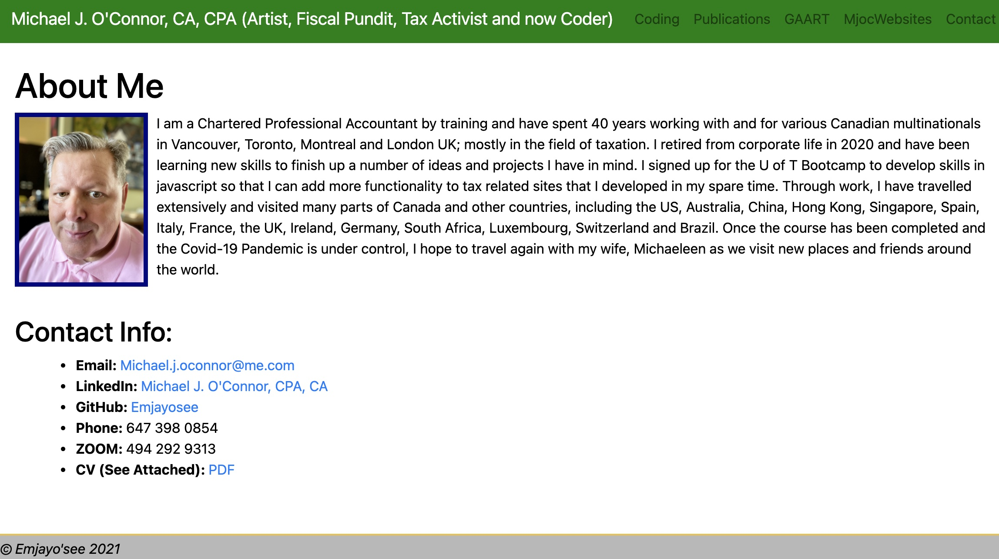

# Unit 20 React Homework: React Portfolio

This is the repo for my Portfolio page in REACT, assignment 20, due March 24, 2021.

Submitted: March 24, 2021, Michael O'Connor, 604 765-6061

# 01 Goal: 

    The goal of this project is to convert our portfolio from Assignment 16 into a REACT environment. Here is a link to the Github folder https://emjayosee.github.io/20_React_Portfolio/
    and a link to the deployed website https://mjoc.herokuapp.com//.

# 02 Approach:

    In approaching the project, I realized that I have sufficient content, but am building my portfolio around my professional art work, websites, professional writing and future projects.  However, with this in mind, I still am working towards meeting the requirements of the assignment, including:

        1. An updated portfolio featuring 6 total projects [X]

        2. Built using using React [X]

        3. A `Header` component that appears on multiple pages [X]

        4. A single `Project` component that will be used multiple times on a single page [X]

        5. Navigation with React Router, dynamic rendering, or another third part router [X]

        6. A `Footer` component that appears on multiple pages [X]

        7. Update GitHub profile with pinned repositories featuring those same projects [X]

        8. Deploy this site to Heroku [X]

    Your updated site should still have all of the content it previously had:

        9. Your name [X]

        10. Links to your GitHub profile & LinkedIn page as well as your email address and phone number [X]

        11. A link to a PDF of your resume with updated projects [X]

        12. A list of projects. For each project, make sure you have the following:

                - Project title [X]
                - Link to the deployed version [X]
                - Link to the GitHub repository [X]
                - GIF or screenshot of the deployed application [X]

# 03 Testing and Quality Control:

    1. Test each of the criteria to confirm functionality.

    2. Format JSX Code to make it easier to follow when viewed at source.

    3. Load the files and tested the page functionality at HEROKU.

# 04 Lessons Learned:

The following lessons learned:

    1. How to constuct files and pages in React.

    2. How to use modular capabilities of REACT to make website more efficient.

    3. Debugging code.

    4. Use of respources on the web for assistance.

    5. That images cannot sit with the compiled code, hence putting them outside in the public folder fixes that.

    6. How very specific naming protocols are.

# 05 Further improvements to make:

The following items should be considered for future enhancements, time and budget permitting:

    1. Video or animation as part of a modal or other user event.

    2. Consider adding a "captcha" page to user emails from users to linit spam.

    3. Fill the white space on the right sides of images with more text.

# 06 Current Renderings:

See Current Rendering at the time of writing in the Assignment19 Repo. 
